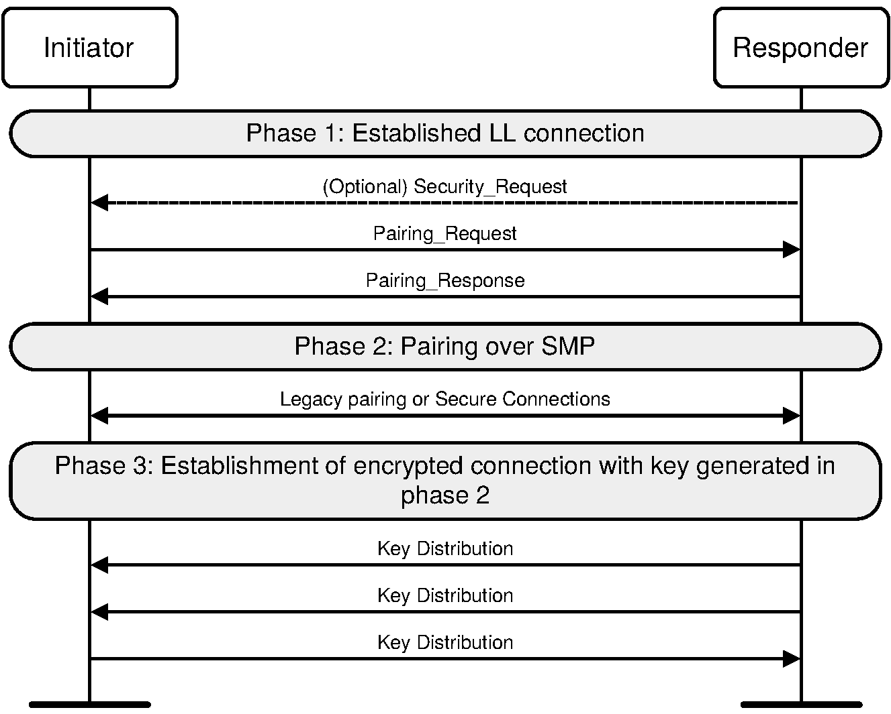
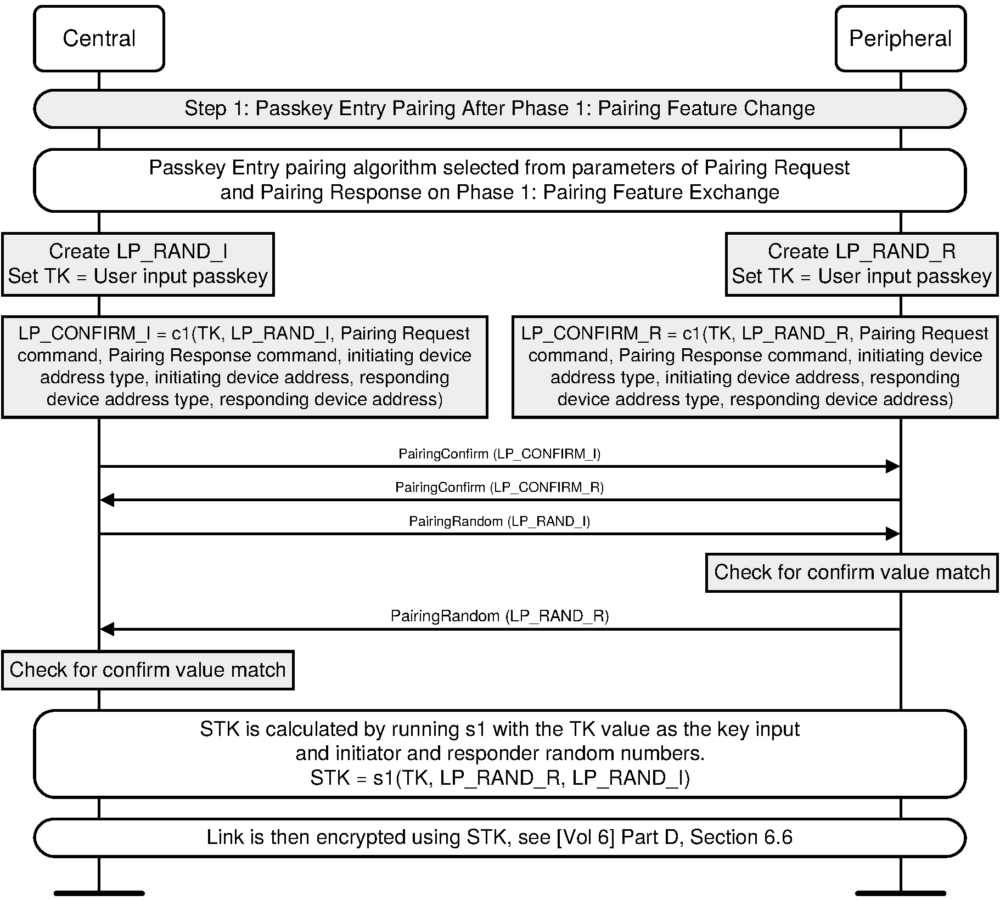

# CMPT789 Assignment 2

After Assignment 1, you now have an idea of how Bluetooth Low Energy (BLE) pairing works at the high level.

This assignment aims to take one step further, to implement another pairing method of BLE and an attack against it.
To make it easy to implement and debug, the current pairing process is implemented on top of TCP rather than Bluetooth.

There are five files (excluding this one) in this repo, *initiator.py*, *responder.py*, *attacker.py*, *toolbox.py*, and *requirements.txt*.

The *initiator.py* implements the pairing logic on the *central* device side while the *responder.py* implements the pairing logic on the *peripheral* device side.

*toolbox.py* contains shared cryptographic functions.

*attacker.py* will be explained later.

In the following of this document, *initiator* indicates the *central* device and *responder* refers to the *peripheral* device.
(For those who are not familiar with those two roles, the *central* device is usually the smartphone and the *peripheral* device is usually the low-end BLE device, e.g., a smartlock.)

The pairing process starts from the initiator device sending out a *pairing request* to the responder device, which is already implemented in the *initiator.py* file.
Your overall goal is to implement the legacy Passkey Entry pairing of BLE and then implement an attack against this pairing process.

To implement the Passkey Entry pairing process, you may need to read the Bluetooth specification to understand how the pairing works.
The pairing process is described in [Volume 3: Host, Part H. Security Manager Specification](https://www.bluetooth.com/wp-content/uploads/Files/Specification/HTML/Core-54/out/en/host/security-manager-specification.html).

You only need to implement the **legacy Passkey Entry** pairing of BLE.

After you've finished the implementation, it's helpful to test your code with [Sample data of *c1()* and *s1()* functions](https://www.bluetooth.com/wp-content/uploads/Files/Specification/HTML/Core-54/out/en/host/security-manager-specification.html#UUID-24e06a05-2f0b-e5c9-7c65-25827ddb9975) to check if your implementation is correct or not.


## Task 0: Environment setup

This project is implemented in python3. The code is tested with python 3.12.3. You may use other versions of python as long as it's compatible with the two dependencies in *requiremnts.txt*.

You can use the following command to install the dependencies:
```
pip pwntools==4.13.0 pycryptodome==3.20.0
```

It's recommended to use a [virtual environment](https://docs.python.org/3/library/venv.html) for this project.
You can also use [virtualenvwrapper](https://virtualenvwrapper.readthedocs.io/en/latest/) to help manage the virual environments.

## Task 1: Implement the legacy Passkey Entry pairing in BLE (30 points)

The legacy Passkey Entry pairing method is used when one device has output capabilities (e.g., screen) and another device has input capabilities (e.g., keyboard).
For example, a laptop pairs with a Bluetooth keyboard.
So the IO capabilities of the initiator is *IO_CAP_KEYBOARD_ONLY* while the IO capabilities of the responder is *IO_CAP_DISPLAY_ONLY*.

This legacy pairing method is used when pairing with legacy devices, where new pairing methods are not available.

**Note that this pairing method is broken and should not be used when new pairing methods are available.**


Similar to the Just Works pairing method, there are also 3 phases in pairing (as shown in the following figure):


### Phase 1: Pairing Feature Exchange

The initiator and responder first exchange their MAC addresses, followed by exchanging their pairing features.

Note that the optional step, **Security_Request**, in the previous figure is not needed in this project.
But before the initiator sends a **Pairing_Request**, the initiator should first send its MAC address and receive the responder's MAC address.

### Phase 2: LE legacy Passkey Entry pairing

In this phase, the two devices generate the Short Term Key (STK), as shown in the following figure:


In this phase, the *responder* will output a 6-digit random number to the screen and the user needs to input this number to the *initiator*.

Please read the specification to find all the details you need to implement.

### Phase 3: Distribute LTK (Long Term Key)

After Phase 2, the **LTK (Long Term Key)** will be encrypted (using STK) and distributed to the responder by the initiator.
*EDIV* and *Rand* can be ignored for now.

Please refer to [2.4.4.1. Encryption setup using STK](https://www.bluetooth.com/wp-content/uploads/Files/Specification/HTML/Core-54/out/en/host/security-manager-specification.html#UUID-8cd2df30-90dd-060d-4612-792ccace362f) to check out how encryption is performed using STK.

Use this formula to derive the session key:
```
session_key = AES_ECB(LTK, SKD)
```

Once the session key and session nonce are ready, use them to encrypt the LTK based on **AES_CCM** encryption and send the encrypted LTK to the responder.
The responder should be able to decrypt the message.

## Task 2: Implementation the sniff attack against this pairing process (50 points)

There is a significant weakness within this pairing method.

Assume the attacker is able to sniff all data exchanged between the initiator and the responder, as implemented in the *sniff()* function in *attacker.py*.

Finish the *attack()* function to launch the attack against this pairing method.

The goal of this attack is to obtain the LTK in plaintext.

**Please do not change the host address and the port number.**

## Task 3: Write a report (20 points)

Write a report explaining the following points:

- How each of the legacy pairing phases are implemented in your code? (5 points)

- What is the weakness in the legacy pairing method and how to exploit it? (15 points)

You can also include other topics you think are important for this project.

## Submit Instruction

Please make sure your code can run.

Your code will be tested by first running *responder.py*, then *attacker.py*, and lastly *initiator.py*.

Please put all your code and report under one folder (e.g., 'proj2') and compress the folder (e.g., using `tar czvf proj2.tgz proj2').

Upload your code in Canvas.